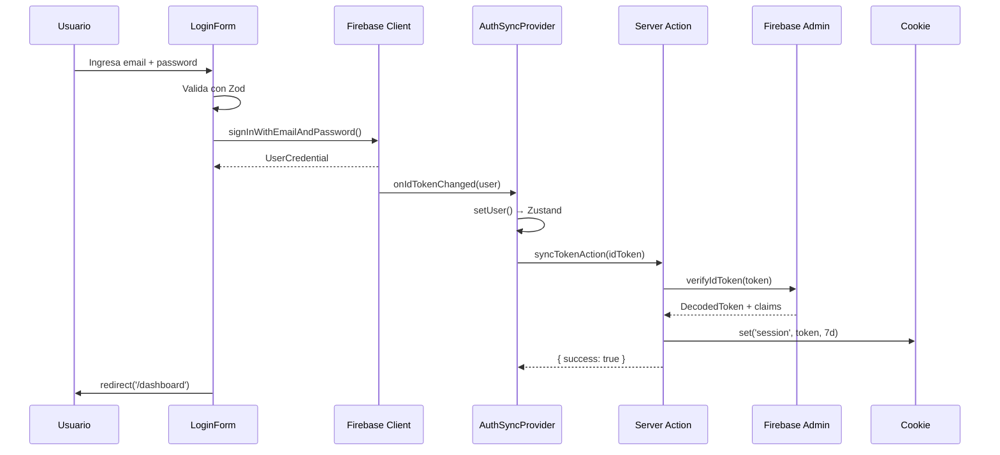
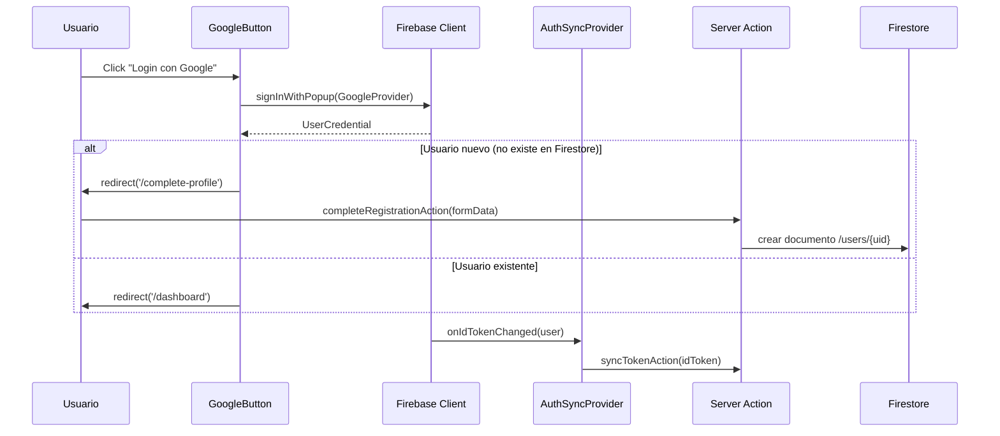
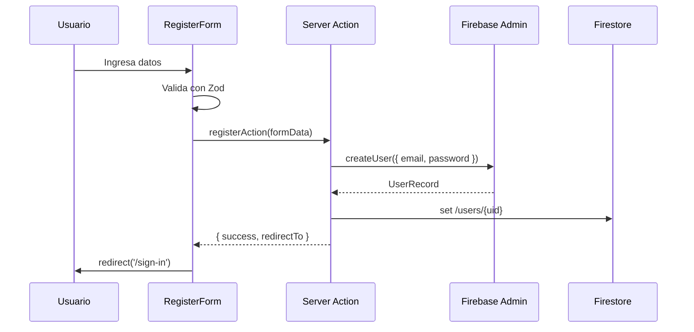

# Módulo de Autenticación - Documentación Completa

> **Última actualización:** Diciembre 2025  
> **Branch:** `feat/migrate-auth-server-actions`  
> **Stack:** Next.js 15 + Firebase Auth + Zustand

---

## 📋 Tabla de Contenidos

1. [Resumen Ejecutivo](#resumen-ejecutivo)
2. [Arquitectura General](#arquitectura-general)
3. [Estructura de Archivos](#estructura-de-archivos)
4. [Flujos de Autenticación](#flujos-de-autenticación)
5. [Componentes del Sistema](#componentes-del-sistema)
6. [Tipos y Schemas](#tipos-y-schemas)
7. [Uso en Componentes](#uso-en-componentes)
8. [Seguridad](#seguridad)
9. [Debugging](#debugging)
10. [Próximos Pasos](#próximos-pasos)

---

## Resumen Ejecutivo

El módulo de autenticación implementa un **patrón híbrido** que combina:

- **Firebase Client SDK** → Autenticación en el navegador
- **Firebase Admin SDK** → Verificación y custom claims en servidor
- **Cookies httpOnly** → Persistencia segura de sesión
- **Zustand + Context** → Estado reactivo SSR-safe

### Principios de Diseño

| Principio        | Implementación                                                    |
| ---------------- | ----------------------------------------------------------------- |
| **Server-First** | Validación y mutaciones solo en Server Actions                    |
| **SSR-Safe**     | Zustand con factory pattern para evitar estado compartido         |
| **Performance**  | Selectores granulares en Zustand (menos re-renders)               |
| **Seguridad**    | Cookies httpOnly, verificación server-side, sin tokens en cliente |

---

## Arquitectura General

```
┌─────────────────────────────────────────────────────────────────────────────┐
│                              CLIENTE (Browser)                               │
├─────────────────────────────────────────────────────────────────────────────┤
│                                                                              │
│   ┌──────────────────┐    ┌──────────────────┐    ┌──────────────────────┐  │
│   │   LoginForm      │    │   RegisterForm   │    │    GoogleButton      │  │
│   │   (react-hook-   │    │   (react-hook-   │    │    (Firebase Auth)   │  │
│   │    form + zod)   │    │    form + zod)   │    │                      │  │
│   └────────┬─────────┘    └────────┬─────────┘    └──────────┬───────────┘  │
│            │                       │                         │              │
│            ▼                       ▼                         ▼              │
│   ┌─────────────────────────────────────────────────────────────────────┐   │
│   │                     Firebase Client SDK                              │   │
│   │         signInWithEmailAndPassword / createUserWithEmail            │   │
│   │                    signInWithPopup (Google)                         │   │
│   └────────────────────────────────┬────────────────────────────────────┘   │
│                                    │                                        │
│                                    ▼                                        │
│   ┌─────────────────────────────────────────────────────────────────────┐   │
│   │                      AuthSyncProvider                                │   │
│   │              (escucha onIdTokenChanged)                             │   │
│   │                                                                      │   │
│   │   1. Actualiza Zustand Store (setUser)                              │   │
│   │   2. Llama syncTokenAction(idToken)                                 │   │
│   └────────────────────────────────┬────────────────────────────────────┘   │
│                                    │                                        │
│   ┌─────────────────────────────────────────────────────────────────────┐   │
│   │                    Zustand Auth Store                                │   │
│   │         { user, isLoading, isAuthenticated, setUser, reset }        │   │
│   │                                                                      │   │
│   │   Componentes usan: useAuthStore((s) => s.user)                     │   │
│   └─────────────────────────────────────────────────────────────────────┘   │
│                                                                              │
└──────────────────────────────────────┬──────────────────────────────────────┘
                                       │
                                       │ Server Action
                                       ▼
┌─────────────────────────────────────────────────────────────────────────────┐
│                              SERVIDOR (Next.js)                              │
├─────────────────────────────────────────────────────────────────────────────┤
│                                                                              │
│   ┌─────────────────────────────────────────────────────────────────────┐   │
│   │                      Server Actions                                  │   │
│   │                   (auth.actions.ts)                                  │   │
│   │                                                                      │   │
│   │   • loginAction(formData)      → signIn + createSession             │   │
│   │   • registerAction(formData)   → createUser + Firestore doc         │   │
│   │   • logoutAction()             → delete cookie                       │   │
│   │   • syncTokenAction(idToken)   → verify + set cookie                │   │
│   │   • resetPasswordAction()      → send reset email                   │   │
│   └────────────────────────────────┬────────────────────────────────────┘   │
│                                    │                                        │
│                                    ▼                                        │
│   ┌─────────────────────────────────────────────────────────────────────┐   │
│   │                    Firebase Admin SDK                                │   │
│   │                                                                      │   │
│   │   • adminAuth.verifyIdToken(token)                                  │   │
│   │   • adminAuth.setCustomUserClaims(uid, { storeId, role })          │   │
│   │   • adminAuth.createCustomToken(uid)                                │   │
│   └────────────────────────────────┬────────────────────────────────────┘   │
│                                    │                                        │
│                                    ▼                                        │
│   ┌─────────────────────────────────────────────────────────────────────┐   │
│   │                      Cookie httpOnly                                 │   │
│   │                                                                      │   │
│   │   name: 'session'                                                   │   │
│   │   maxAge: 7 días                                                    │   │
│   │   httpOnly: true                                                    │   │
│   │   secure: production only                                           │   │
│   │   sameSite: 'lax'                                                   │   │
│   └─────────────────────────────────────────────────────────────────────┘   │
│                                                                              │
│   ┌─────────────────────────────────────────────────────────────────────┐   │
│   │                    getServerSession()                                │   │
│   │                   (server-session.ts)                                │   │
│   │                                                                      │   │
│   │   Lee cookie → verifyIdToken → retorna ServerSession                │   │
│   │   { userId, email, displayName, storeId, role }                     │   │
│   └─────────────────────────────────────────────────────────────────────┘   │
│                                                                              │
└─────────────────────────────────────────────────────────────────────────────┘
```

---

## Estructura de Archivos

```
src/
├── stores/
│   └── auth-store.ts                    # Zustand vanilla store
│
├── lib/
│   ├── auth/
│   │   └── server-session.ts            # getServerSession() - lee cookie
│   └── firebase/
│       ├── admin.ts                     # Firebase Admin SDK config
│       └── client.ts                    # Firebase Client SDK config
│
└── features/
    └── auth/
        ├── auth.types.ts                # Tipos TypeScript
        │
        ├── actions/
        │   └── auth.actions.ts          # Server Actions
        │
        ├── providers/
        │   ├── auth-store-provider.tsx  # Zustand + Context provider
        │   └── auth-provider.tsx        # Token sync provider
        │
        ├── hooks/
        │   └── use-auth-client.ts       # Re-exports (compatibilidad)
        │
        ├── components/
        │   ├── LoginForm.tsx
        │   ├── RegisterForm.tsx
        │   ├── ResetPasswordForm.tsx
        │   ├── GoogleButton.tsx
        │   └── GoogleProfileSetup.tsx
        │
        ├── schemas/
        │   ├── login.schema.ts
        │   ├── register.schema.ts
        │   ├── reset-password.schema.ts
        │   ├── google-profile.schema.ts
        │   ├── complete-registration.schema.ts
        │   ├── store-setup.schema.ts
        │   └── user-profile.schema.ts
        │
        └── services/
            └── server/
                └── auth.service.ts      # Custom claims management
```

---

## Flujos de Autenticación

### 1. Login con Email/Password



### 2. Login con Google



### 3. Registro con Email



### 4. Verificación en Server Components

```typescript
// En cualquier Server Component o Server Action
import { getServerSession } from '@/lib/auth/server-session';

export default async function DashboardPage() {
  const session = await getServerSession();

  if (!session) {
    redirect('/sign-in');
  }

  // Acceso a custom claims
  const { userId, storeId, role } = session;

  // Fetch data del usuario...
}
```

---

## Componentes del Sistema

### 1. Zustand Store (`auth-store.ts`)

```typescript
// Estado
interface AuthState {
    user: AuthUser | null;      // Datos básicos del usuario
    isLoading: boolean;         // Carga inicial
    isAuthenticated: boolean;   // ¿Hay sesión activa?
}

// Acciones
interface AuthActions {
    setUser: (user: AuthUser | null) => void;
    setLoading: (isLoading: boolean) => void;
    reset: () => void;
}

// Factory (SSR-safe)
export const createAuthStore = (initState?) => createStore<AuthStore>()(...)
```

**¿Por qué factory pattern?**

En SSR, cada request debe tener su propia instancia del store. Si usáramos un store global, el estado se compartiría entre requests de diferentes usuarios.

### 2. AuthStoreProvider (`auth-store-provider.tsx`)

Wrappea el store de Zustand en React Context para:

- ✅ SSR-safe (cada request = nueva instancia)
- ✅ Acceso via hooks (`useAuthStore`)
- ✅ Testing fácil (mock con initialState)

```tsx
export function AuthStoreProvider({ children, initialState }) {
  const storeRef = useRef<AuthStoreApi>(undefined);

  if (!storeRef.current) {
    storeRef.current = createAuthStore(initialState);
  }

  return (
    <AuthStoreContext.Provider value={storeRef.current}>
      {children}
    </AuthStoreContext.Provider>
  );
}
```

### 3. AuthSyncProvider (`auth-provider.tsx`)

Se encarga de **sincronizar** Firebase Auth con:

1. **Zustand Store** → UI reactiva
2. **Servidor** → Cookie httpOnly

```tsx
export function AuthSyncProvider({ children }) {
  const setUser = useAuthStore(s => s.setUser);
  const reset = useAuthStore(s => s.reset);

  useEffect(() => {
    const unsubscribe = onIdTokenChanged(auth, async firebaseUser => {
      if (firebaseUser) {
        // 1. Actualizar Zustand
        setUser({
          uid: firebaseUser.uid,
          displayName: firebaseUser.displayName || '',
          email: firebaseUser.email || '',
          photoURL: firebaseUser.photoURL,
          emailVerified: firebaseUser.emailVerified,
        });

        // 2. Sincronizar cookie
        const idToken = await firebaseUser.getIdToken();
        await syncTokenAction(idToken);
      } else {
        reset();
        await logoutAction();
      }
    });

    return () => unsubscribe();
  }, []);

  return <>{children}</>;
}
```

### 4. Server Actions (`auth.actions.ts`)

Todas las mutaciones de autenticación pasan por Server Actions:

| Action                                 | Descripción                             |
| -------------------------------------- | --------------------------------------- |
| `loginAction(formData)`                | Login con email/password → crea sesión  |
| `registerAction(formData)`             | Registro → crea usuario + doc Firestore |
| `logoutAction()`                       | Elimina cookie de sesión                |
| `syncTokenAction(idToken)`             | Sincroniza token → cookie               |
| `resetPasswordAction(email)`           | Envía email de reset                    |
| `completeRegistrationAction(formData)` | Completa perfil (Google users)          |

### 5. getServerSession (`server-session.ts`)

Función para obtener la sesión en el servidor:

```typescript
export async function getServerSession(): Promise<ServerSession | null> {
  const cookieStore = await cookies();
  const token = cookieStore.get('session')?.value;

  if (!token) return null;

  try {
    const decoded = await adminAuth.verifyIdToken(token);
    return {
      userId: decoded.uid,
      email: decoded.email || '',
      displayName: decoded.name || '',
      storeId: decoded.storeId, // Custom claim
      role: decoded.role, // Custom claim
    };
  } catch {
    return null;
  }
}
```

---

## Tipos y Schemas

### Tipos Principales (`auth.types.ts`)

```typescript
// Usuario en Firestore
interface UserDocument {
  id: string;
  email: string;
  displayName: string;
  photoURL?: string;
  phone?: string;
  role: 'owner' | 'admin' | 'employee';
  storeIds: string[];
  currentStoreId?: string;
  createdAt: Timestamp;
  updatedAt: Timestamp;
}

// Usuario para UI (cliente)
interface AuthUser {
  uid: string;
  displayName: string;
  email: string;
  photoURL: string | null;
  emailVerified: boolean;
}

// Sesión del servidor
interface ServerSession {
  userId: string;
  email: string;
  displayName: string;
  storeId?: string;
  role?: 'owner' | 'admin' | 'employee';
}
```

### Schemas Zod

| Schema                       | Uso                                 |
| ---------------------------- | ----------------------------------- |
| `loginSchema`                | Validar formulario de login         |
| `registerSchema`             | Validar formulario de registro      |
| `resetPasswordSchema`        | Validar email para reset            |
| `googleProfileSchema`        | Validar datos adicionales de Google |
| `completeRegistrationSchema` | Validar perfil incompleto           |
| `storeSetupSchema`           | Validar configuración de tienda     |
| `userProfileSchema`          | Validar actualización de perfil     |

---

## Uso en Componentes

### Opción 1: Selectores Granulares (Recomendado)

```tsx
'use client';

import { useAuthStore } from '@/features/auth/providers/auth-store-provider';

function Navbar() {
  // ✅ Solo re-renderea si user cambia
  const user = useAuthStore(state => state.user);

  if (!user) return <LoginButton />;
  return <Avatar src={user.photoURL} />;
}

function LoadingIndicator() {
  // ✅ Solo re-renderea si isLoading cambia
  const isLoading = useAuthStore(state => state.isLoading);

  if (!isLoading) return null;
  return <Spinner />;
}
```

### Opción 2: Hook de Conveniencia

```tsx
'use client';

import { useAuth } from '@/features/auth/providers/auth-store-provider';

function ProfileCard() {
  // ⚠️ Re-renderea si cualquier valor cambia
  const { user, isLoading, isAuthenticated } = useAuth();

  if (isLoading) return <Skeleton />;
  if (!isAuthenticated) return null;

  return <Card>{user.displayName}</Card>;
}
```

### Opción 3: Compatibilidad Legacy

```tsx
'use client';

import { useAuthClient } from '@/features/auth/hooks/use-auth-client';

function LegacyComponent() {
  // ⚠️ Deprecated - migrar a useAuthStore
  const { user } = useAuthClient();
}
```

### En Server Components

```tsx
// app/dashboard/page.tsx
import { getServerSession } from '@/lib/auth/server-session';
import { redirect } from 'next/navigation';

export default async function DashboardPage() {
  const session = await getServerSession();

  if (!session) {
    redirect('/sign-in');
  }

  // Acceso seguro a claims
  const { userId, storeId, role } = session;

  // Fetch data...
  const store = await getStore(storeId);

  return <Dashboard store={store} />;
}
```

---

## Seguridad

### Medidas Implementadas

| Medida                       | Descripción                                  |
| ---------------------------- | -------------------------------------------- |
| **Cookies httpOnly**         | Token no accesible desde JavaScript          |
| **Verificación server-side** | Todos los tokens se verifican con Admin SDK  |
| **Custom Claims**            | Roles y permisos en el token (no en cliente) |
| **Validación Zod**           | Inputs validados antes de procesarse         |
| **No tokens en cliente**     | Solo datos básicos (uid, email, displayName) |

### Custom Claims

Los custom claims (`storeId`, `role`) se gestionan server-side:

```typescript
// Solo en servidor (auth.service.ts)
export async function setCustomClaims(uid: string, claims: CustomClaims) {
  await adminAuth.setCustomUserClaims(uid, claims);
}

// Acceso en servidor
const session = await getServerSession();
if (session?.role !== 'owner') {
  throw new Error('Unauthorized');
}
```

### Roles del Sistema

| Rol        | Descripción                                  |
| ---------- | -------------------------------------------- |
| `owner`    | Dueño de la tienda, acceso completo          |
| `admin`    | Administrador, gestión de productos y ventas |
| `employee` | Empleado, acceso limitado                    |

---

## Debugging

### Logs del Sistema

```typescript
// AuthSyncProvider logs:
'[AuthSyncProvider] Token synced'; // Token sincronizado exitosamente
'[AuthSyncProvider] Logged out'; // Sesión cerrada
'[AuthSyncProvider] Error syncing...'; // Error de sincronización

// Server Actions logs:
'[Auth] Login successful for user...';
'[Auth] Registration completed...';
```

### Verificar Estado

```tsx
// En cualquier componente cliente
const user = useAuthStore(s => s.user);
const isLoading = useAuthStore(s => s.isLoading);

console.log('Auth State:', { user, isLoading });
```

### Verificar Cookie

```typescript
// En Server Action o API Route
import { cookies } from 'next/headers';

const cookieStore = await cookies();
const sessionCookie = cookieStore.get('session');
console.log('Session cookie:', sessionCookie?.value ? 'Present' : 'Missing');
```

### Zustand DevTools

```typescript
// En desarrollo, puedes inspeccionar el store:
// 1. Instalar extensión Redux DevTools
// 2. Agregar devtools middleware (opcional):

import { devtools } from 'zustand/middleware';

export const createAuthStore = initState => {
  return createStore<AuthStore>()(
    devtools(
      set => ({
        // ...state
      }),
      { name: 'auth-store' }
    )
  );
};
```

---

## Próximos Pasos

### Recomendación: Módulo de Dashboard

El siguiente módulo a refactorizar debería ser **Dashboard** por las siguientes razones:

1. **Alta dependencia de Auth** → Ya usa `useAuthClient`, fácil migración a `useAuthStore`
2. **Server Components** → Puede beneficiarse de `getServerSession()`
3. **Custom Claims** → Necesita `storeId` y `role` para permisos

### Tareas Sugeridas para Dashboard

```markdown
1. [ ] Migrar `useAuthClient` → `useAuthStore` con selectores
2. [ ] Convertir páginas a Server Components donde sea posible
3. [ ] Usar `getServerSession()` para validar permisos
4. [ ] Eliminar fetches innecesarios en cliente
5. [ ] Implementar middleware de protección de rutas
```

### Otros Módulos Candidatos

| Módulo           | Prioridad | Razón                       |
| ---------------- | --------- | --------------------------- |
| **Dashboard**    | 🔴 Alta   | Depende de auth, usa claims |
| **Store**        | 🟡 Media  | Depende de storeId          |
| **Products**     | 🟡 Media  | CRUD con permisos           |
| **User Profile** | 🟢 Baja   | Ya parcialmente migrado     |

### Mejoras Pendientes en Auth

```markdown
1. [ ] Implementar refresh token automático (antes de expirar)
2. [ ] Agregar rate limiting a Server Actions
3. [ ] Implementar "Remember me" con diferentes duraciones de cookie
4. [ ] Agregar 2FA (Two-Factor Authentication)
5. [ ] Logging de auditoría para acciones de auth
```

---

## Referencias

- [Firebase Auth Documentation](https://firebase.google.com/docs/auth)
- [Next.js Server Actions](https://nextjs.org/docs/app/building-your-application/data-fetching/server-actions-and-mutations)
- [Zustand + Context Pattern](https://github.com/pmndrs/zustand/discussions/2740)
- [TkDodo: Zustand and React Context](https://tkdodo.eu/blog/zustand-and-react-context)

---

> **Nota:** Este documento debe mantenerse actualizado conforme evolucione el módulo.
